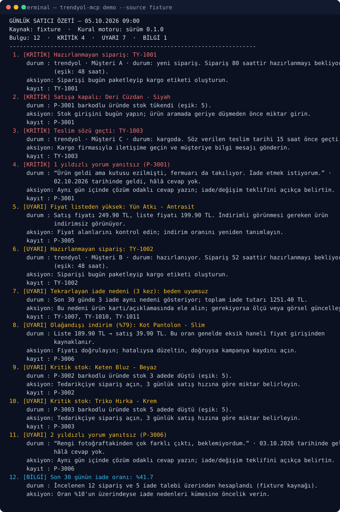

# trendyol-mcp

[](https://github.com/acar32furkan-glitch/trendyol-mcp/actions/workflows/ci.yml)
[](https://www.python.org/)
[](LICENSE)
[](https://docs.astral.sh/ruff/)
[](https://mypy-lang.org/)

**Türkçe** · [English](README.en.md)

**Türk pazaryerleri için salt okunur MCP sunucusu.** Bir satıcının sipariş, iade, stok ve yorum
verisini okur; SLA ihlallerini, stok ve fiyat tuzaklarını bulur ve sabah okuyacağınız **tek Türkçe
aksiyon raporu** üretir. Hiçbir araç satıcı hesabında değişiklik yapmaz.

Kurulum ve kimlik bilgisi olmadan, 30 saniyede deneyin:

```bash
git clone https://github.com/acar32furkan-glitch/trendyol-mcp && cd trendyol-mcp
uv sync --all-extras --dev
uv run trendyol-mcp demo
```



---

## Neden?

Satıcı sabahı panellerde geçiyor: "hazırlanmayan sipariş var mı, stokta ne bitti, hangi yorum
cevapsız, iade neden tekrar ediyor". Bu iş dört-beş farklı ekranda, elle ve sıraya güvenmeden
yapılıyor. trendyol-mcp bu soruları tek yerde toplar ve **öncelik sıralı bir aksiyon listesine**
çevirir — MCP üzerinden Claude Code / Cursor / Codex'e, ya da doğrudan terminale.

En kritik tasarım kararı: araç yalnızca **okur**. Bir ajanın yanlış argümanla fiyat güncellemesi
veya sipariş iptali yapması mimari olarak imkânsızdır
([ADR-0001](docs/adr/0001-read-only-by-design.md)).

## MCP istemcisine bağlama

```json
{
  "mcpServers": {
    "trendyol-mcp": {
      "command": "uv",
      "args": ["run", "--directory", "/tam/yol/trendyol-mcp", "trendyol-mcp", "serve", "--source", "auto"]
    }
  }
}
```

`--source auto` kimlik bilgisi bulursa canlı Trendyol API'sini, bulamazsa örnek veri setini kullanır.
Sunucu, ajanı yanlış yönlendirmemek için tüm araçları `readOnlyHint: true` olarak bildirir ve
`instructions` alanında "bu sunucu hiçbir şeyi değiştirmez" bilgisini verir.

## Araçlar

| Araç | Ne yapar | Döndürdüğü |
|------|----------|------------|
| `daily_digest` | Tüm kuralları çalıştırır | Önceliklendirilmiş bulgu listesi + Türkçe rapor metni |
| `sla_breaches` | Hazırlık süresini aşan / teslim sözü geçmiş siparişler | `critical`/`warning` bulgular |
| `stock_alerts` | Stok eşiğinin altındaki ürünler (tükenenler önce) | Bulgular + `threshold` |
| `return_clusters` | Son N günde tekrarlayan iade nedenleri | Bulgular + `return_rate` |
| `unanswered_reviews` | Cevapsız kalmış olumsuz yorumlar | Bulgular |
| `price_overview` | Fiyat tutarsızlıkları (listeden yüksek, aşırı indirim) | Bulgular + indirim özeti |
| `list_orders` | Sipariş listesi (durum/tarih filtresi) | Sipariş kayıtları |
| `list_returns` | İade/talep kayıtları | İade kayıtları |

Kural tanımları, eşikler ve örnek mesajlar: **[docs/rules.md](docs/rules.md)**.

```bash
uv run trendyol-mcp tools                # araçları listele
uv run trendyol-mcp demo --json          # ajanın gördüğü JSON sözleşmesi
uv run trendyol-mcp --help
```

## Gerçek veriye geçiş

İki pazaryeri de aynı arayüzü kullanır; hangi kimlik bilgisi tanımlıysa `--source auto` onu seçer.

```bash
cp .env.example .env        # .env commit edilmez
# Trendyol:      TRENDYOL_SUPPLIER_ID / TRENDYOL_API_KEY / TRENDYOL_API_SECRET
# Hepsiburada:   HEPSIBURADA_MERCHANT_ID / HEPSIBURADA_API_KEY (+ HEPSIBURADA_MERCHANT_NAME)
uv run trendyol-mcp check                     # "aktif kaynak" ve "yorum okuma" satırına bakın
uv run trendyol-mcp demo --source hepsiburada
uv run trendyol-mcp serve
```

Yalnızca `GET` istekleri yapılır (`/integration/order/...`, `/integration/product/...` — Trendyol;
`/orders`, `/returns`, `/listings/merchantid/...` — Hepsiburada). Kimlik bilgileri ortam
değişkeninden okunur, loglanmaz. Her pazaryerinin neyi okuyabildiği (ve neyi okuyamadığı)
`docs/rules.md` içindeki **yetenek matrisinde**; Hepsiburada'da ürün yorumu uç noktası olmadığı için
günlük özet bu kuralı atladığını `not:` satırıyla söyler. Ayrıntı: [SECURITY.md](SECURITY.md).

Bir şey ters gittiğinde: **[docs/sorun-giderme.md](docs/sorun-giderme.md)** — 401/403/429, eksik
kimlik bilgisi ve boş veri durumları için "belirti → neden → çözüm" tabloları ve gerçek komut çıktıları.

## Mimari

```text
adapters/  →  domain/  →  tools.py  →  server.py (MCP)  ·  cli.py (terminal)
 (salt okunur)  (saf kural)   (JSON)      (read-only araç kaydı)
```

- `adapters/` pazaryeri ham verisini normalize modellere çevirir: `FixtureAdapter`, `TrendyolAdapter`,
  `HepsiburadaAdapter`. Kimlik doğrulama, yeniden deneme ve alan dönüşümü `adapters/http.py` ile
  `adapters/parsing.py` içinde tek yerde durur; yeni pazaryeri eklemek tek dosyalık bir iştir.
- `domain/` saf fonksiyonlar içerir; her kural `now` parametresi alır → testler deterministik.
- `render.py` bulguları Türkçe metne çevirir; CLI ve MCP **aynı** metni gösterir.
- Diyagram ve gerekçeler: [docs/architecture.md](docs/architecture.md) · karar kayıtları: [docs/adr/](docs/adr/)

## Kalite

```bash
uv run ruff check . && uv run ruff format --check .
uv run mypy                              # strict, tüm paket + testler + betikler
uv run pytest --cov=trendyol_mcp         # 84 test, ~%91 kapsam
```

- **84 test**: kural sınırları (48/72 saat tam sınırları gibi), iki pazaryerinin HTTP eşlemesi
  (`respx`), CLI sözleşmesi ve **stdio üzerinden gerçek MCP turu** (`tests/test_server_mcp.py`:
  el sıkışma → `tools/list` → `tools/call`).
- CI: Python 3.12 ve 3.13 · ruff · ruff format · mypy strict · pytest · kimlik bilgisi olmadan CLI smoke testi.
- `server.py` yalnızca alt süreçte çalıştığı için kapsam raporunda 0 görünür; canlı doğrulaması entegrasyon testindedir.

## İlkeler ve sınırlar

- **Salt okunur:** yazma/güncelleme yok, panel kazıma yok ([ADR-0001](docs/adr/0001-read-only-by-design.md)).
- **İki pazaryeri, tek sözleşme:** Trendyol ve Hepsiburada adaptörleri aynı salt okunur protokolü
  uygular; okunamayan veri (ör. Hepsiburada yorumları) sessizce atlanmaz, özet `not:` düşer.
- **Kimlik bilgisi olmadan çalışır:** örnek veri seti kendi zaman çapasını taşır
  ([ADR-0002](docs/adr/0002-fixture-first-testability.md)) → demo ve testler tekrarlanabilir.
- **Örnek veri anonimdir:** gerçek müşteri, sipariş veya fiyat bilgisi içermez.
- **Resmî değildir:** bu proje Trendyol ile bağlantılı değildir; satıcı kendi verisini kendi
  kimlik bilgisiyle okur. "Trendyol" ilgili şirketin markasıdır.
- **Yol haritası:** Hepsiburada adaptörü, e-posta raporu, zamanlanmış çalışma → [docs/roadmap.md](docs/roadmap.md).

## Katkı

Issue ve PR'lar açıktır: [CONTRIBUTING.md](CONTRIBUTING.md) · [CODE_OF_CONDUCT.md](CODE_OF_CONDUCT.md) ·
[SECURITY.md](SECURITY.md) · değişiklikler: [CHANGELOG.md](CHANGELOG.md)

## Lisans

[MIT](LICENSE) © 2026 Furkan Acar (acar32furkan-glitch)
