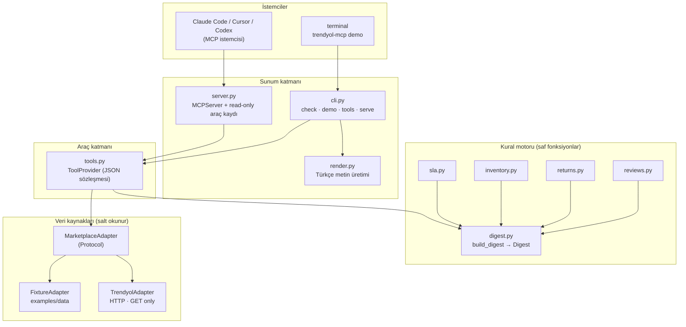

# Mimari

Bu belge, bir satıcının günlük operasyon sorusunu ("bugün neye bakmam gerek?") kimlik bilgisi
olmadan da yanıtlanabilir kılan katmanları anlatır.

## Katmanlar



## Veri akışı

1. **Adaptör** pazaryeri ham verisini normalize edilmiş modellere çevirir (`models.py`).
2. **Kural motoru** bu modeller üzerinde saf fonksiyonlar çalıştırır; her kural `now` parametresi
   alır, böylece testler sabit zamana göre tekrarlanabilir olur.
3. `build_digest` bulguları `critical > warning > info` sırasına dizer ve `Digest` döner.
4. **render.py** bu bulguları tek bir Türkçe metne çevirir — CLI ve MCP aynı metni gösterir.
5. **tools.py** her aracı JSON'a çevrilebilir bir sözlük olarak sunar; `server.py` bunları MCP'ye
   `read_only_hint` işaretiyle kaydeder.

## Neden bu ayrım?

| Karar | Gerekçe | Kayıt |
|-------|---------|-------|
| Salt okunur adaptör arayüzü | Kaza eseri veri değişikliğini mimari olarak imkânsız kılmak | ADR-0001 |
| Örnek veri adaptörü birinci sınıf vatandaş | Kimlik bilgisi olmadan değerlendirme, tekrarlanabilir demo/test | ADR-0002 |
| Zamanın enjekte edilmesi | "Dün gece çalıştı, bugün çalışmıyor" sınıfı hataları testlerde yakalamak | — |
| Kural ve metnin ayrılması | Aynı bulgunun CLI/MCP/e-posta çıktılarında farklılaşmaması | — |

## Dosya düzeni

```
src/trendyol_mcp/
├─ adapters/    # veri kaynakları (base Protocol, fixture, trend yol)
├─ domain/      # kural motoru (saf fonksiyonlar)
├─ models.py    # normalize modeller + Türkçe etiketler
├─ tools.py     # MCP/CLI ortak araç katmanı
├─ render.py    # Türkçe metin üretimi
├─ server.py    # MCP kaydı (read-only)
└─ cli.py       # check · demo · tools · serve
```

## Genişletme noktaları

- **Yeni pazaryeri:** `adapters/<isim>.py` + `adapters/__init__.py` dışa açımı.
- **Yeni kural:** `domain/<konu>.py` içinde saf fonksiyon + `digest.py` içinde çağrı + `docs/rules.md` kaydı.
- **Yeni yüzey:** `render.py` biçimlendiricisi eklemek yeterli (e-posta/Slack planı için bkz. yol haritası).
